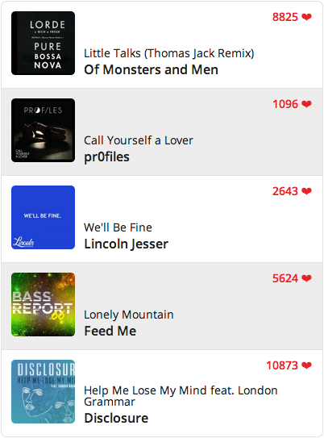

# Hyped

[](https://bitdeli.com/free "Bitdeli Badge")

Easily display your most recent loved songs from The Hype Machine - [hypem.com](http://hypem.com). 

##### Click [here](http://sandbox.charliehield.com/hyped/) to see a demo.



## Installation

#### via [Bower](http://bower.io)

```bash
$ bower install hyped
```

#### Manually

Make sure to include both `jQuery` and `jquery.hyped.js`.

```javascript
<script src="path.to.jQuery"></script>
<script src="path.to.jquery.hyped.js"></script>
```

## Options

- `username` : `string` Your Hypem username - ***Required***
- `count` : `integer` Number of songs to return - **Default**: `5`
- `artwork` : `boolean` Display album artwork - **Default** : `true`
- `thumbSize` : `string` What size album artwork to show - **Default** : `medium`
    - `small` : 50x50 px
    - `medium` : 120x120 px
    - `large` : 320x320 px
- `linked` : `boolean` Wrap song info in a clickable link - **Default** : `false`
- `loveCount` : `boolean` Display track love count - **Default** : `false`


## Example

HTML

```html
<div class="hyped">
	// Optional loading message / spinner
	<div class="loading"></div>
</div>
```

JavaScript

```javascript
$(".hyped").hyped({
	username : "stursby",
	linked : true,
  	count : 5,
  	loveCount : true
});
```

## License

Hyped is licensed [MIT](http://opensource.org/licenses/MIT)

* * *

Copyright (c) 2013 Charlie Hield

